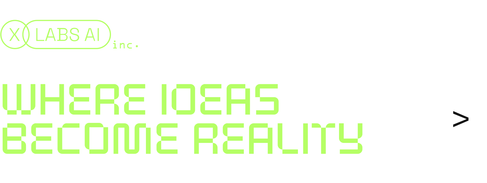
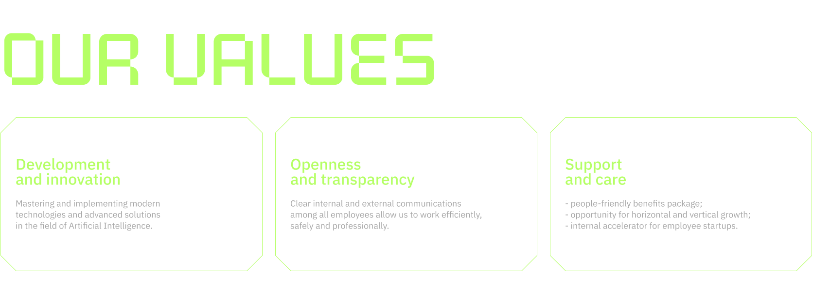
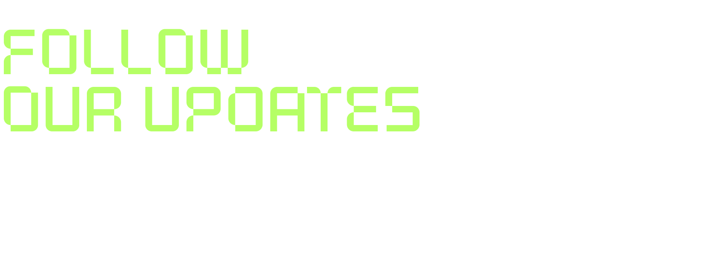

XLabs AI is a part of an international company, a product laboratory where we strive to become leaders in machine learning and neural networks. The company develops and implements revolutionary solutions, setting new standards and inspiring to achieve the impossible in the field of information technology. Our team is an open, energized, and young collective that welcomes innovative ideas and supports the initiative and creativity of our employees.

We're launching a whole line of innovative products — B2B and B2C services that are entirely AI-based and are already influencing the evolution of generative AI. Our team develops and implements disruptive solutions, setting new standards in the industry and inspiring to achieve the impossible. We are young, bright, and friendly. Everyone's ideas and initiatives are supported in our company, and we are always ready to help each other. We are currently actively looking for specialists to work on our exciting projects.

Learn more about the company's work directions on our [website](https://xlabs.by)

[Send your job inquiry](https://t.me/xlabs_ai) to us on Telegram

